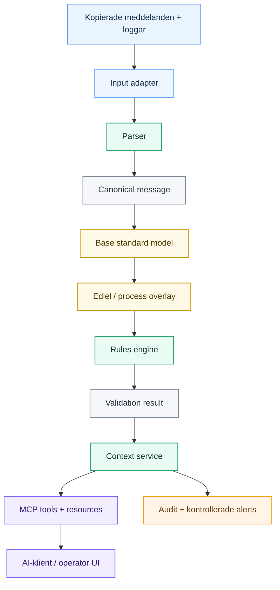

# Tydels arkitektur

Det här dokumentet beskriver hur Tydel är tänkt att fungera, vilka systemgränser som gäller och vilka principer som ska styra implementationen. Syftet är att en utvecklare eller samarbetspartner ska kunna förstå helheten innan någon ändrar systemet.

Tydel är fortfarande under utveckling. Arkitekturen nedan är den nuvarande riktningen, inte ett påstående om att varje tekniskt val är slutgiltigt.

## Designprinciper

### Håll sanningen utanför språkmodellen

Parsing och validering ska vara deterministisk, versionsstyrd och testbar. En LLM får förklara ett verifierat resultat, men får inte hitta på regler eller ändra valideringsutfallet.

### Separera grundstandard från marknadsprofil

Generell UN/EDIFACT-struktur och svenska Ediel-/affärsprocessregler är olika evidenslager. De ska versionsstyras och kunna spåras oberoende av varandra.

En maskinläsbar grundmodell kan beskriva den generella meddelandestrukturen. Den blir inte auktoritativ för svenska affärsregler bara för att den är enklare för programvara att läsa.

### Håll externa specifikationsformat utbytbara

OpenEDI utvärderas som inputformat för generell EDI/EDIFACT-struktur. Tydels canonical message model och interna validation-rule model får inte bli beroende av OpenEDI-specifika fältnamn eller en extern valideringstjänst.

### Gör så lite dubbelarbete som möjligt

Varje meddelande ska parsas en gång och därefter passera genom systemet som en gemensam strukturerad modell. Undvik upprepade konverteringar mellan rå EDIFACT, textsammanfattningar och verktygsspecifika format.

### Gör varje steg observerbart

Varje steg ska kunna lämna ett strukturerat resultat med timing, regelversion och trace-information. Ett misslyckat körfall ska kunna reproduceras utan kontakt med ett produktionssystem.

### Börja read-only

De första integrationerna arbetar med kopior av meddelanden, fel och loggar. Inline-routing, korrigering och återsändning är separata framtida funktioner med betydligt högre risk.

### Håll adapters utbytbara

SFTP, filimport, API, AS2 och HTTPS är möjliga sätt att ta emot data. De hör hemma i adapters och får inte forma kärnans valideringsmodell.

### Väx från en fungerande vertikal slice

Första målet är en komplett väg genom systemet: läs ett uttryckligen stött meddelande, parsa det, validera det och returnera ett användbart resultat genom MCP. Fler meddelandetyper och tjänster kommer först därefter.

## Systemöversikt



## Huvudsteg

### 1. Input

En adapter tar emot ett kopierat meddelande, en fil eller ett registrerat fel och sparar var datan kom ifrån och när den togs emot. Kärnan får inte anta en viss transport.

### 2. Parse

Parsern omvandlar EDIFACT-syntax till Tydels canonical message model. Originalinnehåll och källpositioner bevaras så att varje resultat kan peka tillbaka på exakt segment och dataelement.

Syntaxfel returneras som strukturerade parse errors och får inte krascha processen. Parsern är en Tydel-komponent; en maskinläsbar standardmodell ersätter inte behovet av korrekt parsing av rå EDIFACT.

### 3. Lös upp grundstandarden

Tydel hämtar den generella meddelandestrukturen för namngiven EDIFACT message/version.

OpenEDI är nuvarande kandidat i M0 eftersom formatet kan uttrycka bland annat messages, loops, segments, composites, data elements, occurrence constraints och syntax/situational rules som OpenAPI Schema Objects med EDI-specifika extensions.

Base-standard-importern ska översätta externa representationer till Tydels interna regelmodell. Rules engine ska inte behöva veta om en grundregel ursprungligen kom från OpenEDI, en manuellt kuraterad definition eller en framtida källa.

Varje importerad constraint ska bevara provenance, minst source identifier, publisher, model/version/edition, exakt regelposition och checksum för lokala källbytes när det är relevant.

### 4. Lägg på Ediel-/processprofilen

Svenska Ediel- och affärsprocessregler läggs ovanpå som ett separat versionsstyrt lager. Lagret kan skärpa, specialisera eller komplettera grundstandarden men får inte tyst mutera den lagrade grundmodellen.

Regler ska minst kunna klassificeras som `BASE_STANDARD`, `SWEDISH_PROFILE`, `BUSINESS_PROCESS` eller `TYDEL_SAFETY`.

Auktoritativ källa för svenska och processpecifika regler är relevant officiell marknadsdokumentation, inte OpenEDI eller EdiNation.

### 5. Validera

Rules engine kontrollerar canonical message mot ett uttryckligen namngivet och versionsstyrt regelpaket. Regler kan omfatta struktur, obligatoriska segment och värden, code lists, datatyper/format, occurrences, generell EDIFACT-syntax och verifierade Ediel-affärsregler.

Primärt output är ett maskinläsbart validation result, inte en textsammanfattning. Ett användbart fel ska kunna ange message/version, exakt segment/element, stabilt Tydel rule ID, rule layer, expected/observed samt provenance/evidence.

### 6. Bygg kontext

Context service kombinerar valideringsresultatet med godkända referenser och behörig operativ metadata. Den ska tydligt skilja mellan vad som observerats, vad som slagits upp och vad som fortfarande är okänt.

### 7. Exponera via MCP

MCP-servern ska erbjuda smala tools, exempelvis `validate_message`, `get_validation_result`, `explain_error_context` och `find_reference`. Specifications och code lists kan exponeras som resources. Tool-resultat ska innehålla strukturerad data, evidence och stabila error codes.

### 8. Presentera och agera

En AI-klient eller operator UI gör det strukturerade resultatet begripligt för människan. Notifications är kontrollerade workflows utanför valideringskärnan. Ingen produktionskorrigering, retransmission eller annan write action hör till första versionen.

## OpenEDI-gräns

M0-beslutet är att **utvärdera**, inte okritiskt införa, OpenEDI.

```text
OpenEDI / annan extern schemaform
          ↓ import
Tydels interna base rules
          +
Svensk Ediel / process overlay
          ↓
Resolved Tydel rule set
```

Tydel får inte behandla en extern EdiNation-validator som sin egen sanningskälla, anta att OpenEDI-modeller är auktoritativa för svensk marknadsanvändning, exponera OpenEDI-detaljer som publikt validator contract eller lägga nedladdade modeller i det publika repot utan rättighetsgranskning.

Se [`docs/research/openedi-evaluation.md`](docs/research/openedi-evaluation.md) och [`docs/decisions/0002-openedi-machine-readable-standard-layer.md`](docs/decisions/0002-openedi-machine-readable-standard-layer.md).

## Systemgränser

Tydel är inte en ersättare för Ediel, en central marknadsplattform, ett EDI-transportnät, ett grid-control system, ett forecasting-system i första produkten, en compliance-myndighet eller en EdiNation-wrapper. Befintliga EDI-system och marknadsplattformar förblir auktoritativa för sina respektive funktioner.

## Planerad kodstruktur

```text
src/
  adapters/       Input och externa system
  domain/         Canonical message- och validation-typer
  parser/         EDIFACT parsing
  standards/      Import och normalisering av extern grundstandard
  rules/          Interna versionsregler + Ediel/process overlays
  context/        Evidence och operativ kontext
  mcp/            MCP tools, resources och transport
  audit/          Trace- och audit events
  app/            Composition och startup
tests/
  unit/
  integration/
fixtures/
  edifact/
```

Mappar ska följa verkliga modulgränser. Vi skapar inte tomma source-mappar innan första vertical slice visar vad som faktiskt behövs.

## Dataregler

- Lagra originalmeddelandet separat från härledda förklaringar.
- Lägg aldrig secrets eller produktionscertifikat i repositoryt.
- Använd syntetiska eller korrekt anonymiserade fixtures.
- Ge rule sets och referensdokument explicita versioner.
- Behåll evidence links med genererade förklaringar.
- Separera generella base rules från svenska/profile overlays.
- Bevara checksum/version för externa maskinläsbara modeller som regler härletts från.
- Behandla saknad kontext som okänd, aldrig som tillåtelse att gissa.

## Öppna beslut

- Vilken message type/profile ska stödjas först?
- Innehåller OpenEDI-modellen för exakt den message/version tillräcklig semantik för första vertical slice?
- Hur ska slutlig canonical message schema se ut?
- Hur ska intern rule representation se ut?
- Vilka officiella specifications får lagras eller indexeras juridiskt?
- Vilka OpenEDI-modeller får eventuellt redistribueras?
- Vilken MCP transport/authentication passar första deployment?
- Vilken data måste stanna hos kunden?

Arkitekturbeslut ska dokumenteras i [`docs/decisions/`](docs/decisions/).
