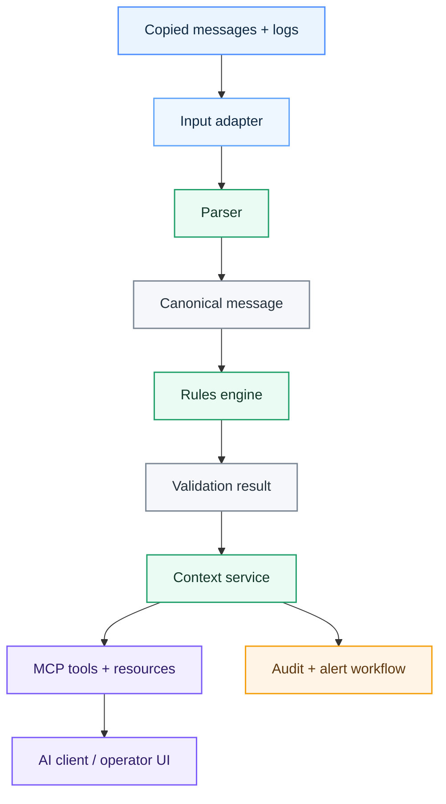

# Tydel architecture

This document explains how Tydel is intended to work and where its boundaries are. It should help contributors understand the system before changing it.

The structure is inspired by [esbuild's architecture documentation](https://github.com/evanw/esbuild/blob/main/docs/architecture.md): start with the whole system, state the design principles, then explain each stage. Tydel is still an experiment in progress. The current design is a direction, not proof that every choice is final.

## Design principles

### Keep the truth outside the language model

Parsing and validation must be deterministic, versioned and testable. An LLM may explain a result, but it must not invent a rule or silently change the validation outcome.

### Do as little work as possible

Parse each message once and pass a shared structured model through later stages. Avoid repeated conversions between raw EDIFACT, text summaries and tool-specific formats.

### Make every stage observable

Each stage should return a structured result with timing, rule version and trace information. A failed run should be possible to replay without contacting a production system.

### Start read-only

The first integrations consume copies of messages, errors and logs. Inline routing, correction and retransmission are separate future capabilities with a much higher risk level.

### Keep adapters replaceable

SFTP, file imports, APIs, AS2 and HTTPS are possible ways to receive data. They belong in adapters and must not shape the core validation model.

### Grow from one working path

The first goal is one complete path: load one supported message type, parse it, validate it and return a useful error through MCP. New message types and services come after this works.

## System overview



## Main stages

### 1. Input

An adapter receives a copied message, a file upload or a recorded error. It records where the data came from and when it was received.

The core must not assume a specific transport.

### 2. Parse

The parser turns EDIFACT syntax into a canonical message model. It preserves the original content and source positions so every result can point back to the exact segment and element.

A syntax problem returns a structured parse error. It must not crash the process.

### 3. Validate

The rules engine checks the canonical message against a named and versioned rule set. Rules may cover:

- message structure;
- required segments and values;
- code lists;
- field types and formats;
- Ediel-specific business rules that we are legally allowed to implement.

The output is a machine-readable validation result. Plain-language text is not the primary result.

### 4. Build context

The context service combines the validation result with approved references and authorized operational metadata. It must label what was observed, what was looked up and what is still unknown.

### 5. Expose through MCP

The MCP server exposes narrow tools such as:

- `validate_message`
- `get_validation_result`
- `explain_error_context`
- `find_reference`

Specifications and code lists can be exposed as resources. Tool results should include structured content, evidence and stable error codes.

### 6. Present and act

An AI client or operator UI turns the structured result into an explanation. Notifications are controlled workflows outside the validation core.

No production correction, retransmission or other write action belongs in the first version.

## System boundaries

Tydel is not:

- an Ediel replacement;
- a central market platform;
- an EDI transport network;
- a grid-control system;
- a forecasting system in the first product;
- an authority on compliance.

Existing EDI systems and market platforms remain authoritative.

## Planned code layout

This layout will be created as implementation begins:

```text
src/
  adapters/       Input and external-system adapters
  domain/         Canonical message and validation types
  parser/         EDIFACT parsing
  rules/          Versioned validation rules
  context/        Evidence and operational context
  mcp/            MCP tools, resources and transport
  audit/          Trace and audit events
  app/            Composition and startup
tests/
  unit/
  integration/
fixtures/
  edifact/
```

Folders should follow real module boundaries. We will not create empty source folders before the first vertical slice defines what they need.

## Data rules

- Store the original message separately from derived explanations.
- Never put secrets or production certificates in the repository.
- Use synthetic or properly anonymized fixtures.
- Give rule sets and reference documents explicit versions.
- Keep evidence links with every generated explanation.
- Treat missing context as unknown, not as permission to guess.

## Decisions still open

- Which message type should be supported first?
- Is the current EDIFACT library reliable enough for Ediel rules?
- What is the canonical message schema?
- Which official specifications can be stored or indexed legally?
- Which MCP transport and authentication model fit the first deployment?
- What data must remain at the customer's site?

Answers that affect the architecture should be recorded in [`docs/decisions/`](docs/decisions/).
