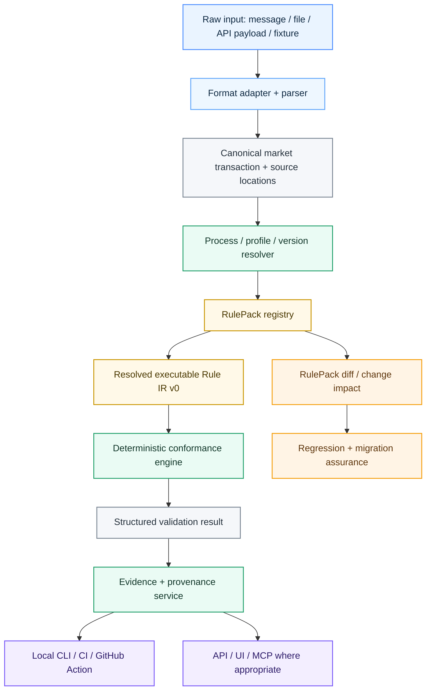

# Tydels arkitektur

Det här dokumentet beskriver Tydels nuvarande arkitekturriktning efter DHV-checkpointen 2026-10-05.

Tydel är ett research-stage, lokalt först **energy-market conformance and CI/CD layer** ovanpå en deterministisk conformance- och diagnostikkärna. Svensk Ediel är första wedge och UTILTS/APERAK är första planerade M1 vertical slice. Arkitekturen ska kunna växa till fler syntax-/profile-familjer utan att M1 överkonstrueras.

## Designprinciper

### 1. Håll sanningen utanför språkmodellen

Parsing, rule resolution och validation ska vara deterministiska, versionsstyrda och testbara. En LLM får förklara verifierade resultat men får inte:

- avgöra `PASS/FAIL`;
- skapa normativa regler utan source/review;
- ändra validation outcome;
- gissa framtida marknadskontrakt.

### 2. Optimera för regelresolution, inte ett filformat

Tydels centrala fråga är:

```text
transaction
+ jurisdiction
+ process
+ profile
+ as-of date
        ↓
which exact rules apply?
```

EDIFACT, XML, CIM och API payloads är inputfamiljer. De får inte definiera domänkärnan.

### 3. Behåll formatadapters separata

Varje syntaxfamilj ska parsas av en explicit adapter/parser som producerar en gemensam canonical transaction plus source locations.

M1 implementerar **endast EDIFACT-stödet som behövs för den valda UTILTS/APERAK-slicen**.

Vi bygger inte XML, CIM, REST och DHV samtidigt bara för att arkitekturen ska kunna stödja dem senare.

### 4. Rule IR v0 är låst före M1

Tydel använder ett internt, tool-neutral Rule IR-kontrakt. Vi skapar inte ett eget user-facing regelspråk innan verklig authoring-/rule-operations-data motiverar det.

Flödet är:

```text
Normative source
      ↓
Importer / curated extraction
      ↓
Tydel Rule IR v0
      ↓
Source + human verification
      ↓
Versioned executable RulePack
      ↓
Conformance runtime
```

Canonical contract:

- `docs/architecture/rule-ir-v0.md`
- `schemas/rule-ir-v0.schema.json`
- Decision 0006

Rule IR v0 har bounded assertion primitives och **ingen arbitrary-code escape hatch**. Om en verifierad obligatorisk regel inte kan uttryckas korrekt markeras semantiken explicit `unsupported` i stället för att gömmas i specialkod.

Rules engine ska inte behöva veta om en regel ursprungligen kom från OpenEDI, XSD, en Ediel-guide, SHACL eller manuell kuratering.

### 5. Version och tid är first-class

En regel måste kunna gälla under en begränsad period. Runtime ska därför kunna lösa rätt RulePack för ett explicit `as_of`-datum.

Det gör historisk reproduktion, migrationstest och change-impact möjligt utan att gamla regler skrivs över.

### 6. Separera auktoritetslager

En generell syntax-/schemaartefakt är inte automatiskt auktoritet för en svensk eller nordisk affärsprocess.

Minsta regelklasser:

- `BASE_STANDARD`
- `MARKET_PROFILE`
- `BUSINESS_PROCESS`
- `TYDEL_SAFETY`

För M1 motsvarar `MARKET_PROFILE` i praktiken svenska Ediel/profile-regler. Senare kan samma lager bära andra marknadsprofiler.

### 7. Bevara provenance per regel

Varje normativ regel ska minst kunna bära:

```text
rule_id
jurisdiction
process
message/profile
syntax
effective_from
effective_to
assertion
source_id
source_edition
source_location
source_checksum when applicable
review_status
```

Convenience är aldrig authority.

### 8. Read-only och local-first först

Första produktfaserna arbetar med lokala fixtures, kopior, meddelanden och loggar. Tydel ska inte routa, korrigera eller återsända produktionsmeddelanden.

Primär leveransyta är lokal CLI/CI. Cloud service är inte ett krav för kärnvalidering.

### 9. Samma core, flera accessytor

Local CLI, CI/GitHub Action, API, operator UI och MCP ska vara olika clients/surfaces över samma validation core.

MCP är inte validatorn och inte parsern.

---

## Systemöversikt


```mermaid
flowchart TD
    A["Raw input: message / file / API payload / fixture"]:::input --> B["Format adapter + parser"]:::adapter
    B --> C["Canonical market transaction + source locations"]:::data
    C --> D["Process / profile / version resolver"]:::core
    D --> E["RulePack registry"]:::standard
    E --> F["Resolved executable Rule IR v0"]:::standard
    F --> G["Deterministic conformance engine"]:::core
    G --> H["Structured validation result"]:::data
    H --> I["Evidence + provenance service"]:::core
    I --> J["Local CLI / CI / GitHub Action"]:::mcp
    I --> K["API / UI / MCP where appropriate"]:::mcp

    E --> L["RulePack diff / change impact"]:::future
    L --> M["Regression + migration assurance"]:::future

    classDef input fill:#EAF4FF,stroke:#4C8DFF,color:#102A43,stroke-width:1.5px;
    classDef adapter fill:#EEF7FF,stroke:#60A5FA,color:#102A43,stroke-width:1.5px;
    classDef core fill:#EAFBF4,stroke:#22A06B,color:#12372A,stroke-width:1.5px;
    classDef data fill:#F5F7FA,stroke:#7B8794,color:#25313C,stroke-width:1.5px;
    classDef standard fill:#FFF9E8,stroke:#C99500,color:#4A3800,stroke-width:1.5px;
    classDef mcp fill:#F3EEFF,stroke:#7A5AF8,color:#2D1B69,stroke-width:1.5px;
    classDef future fill:#FFF4E5,stroke:#F59E0B,color:#5F370E,stroke-width:1.5px;
```

---

## Domänobjekt

### RawInput

Originalbytes/text plus metadata om källa, mottagningstid och inputtyp. Originalet bevaras separat från härledda tolkningar.

### CanonicalTransaction

En marknadsneutral representation av den transaction som Tydel behöver validera, inklusive:

- normalized identifiers;
- process/message/profile hints;
- source locations tillbaka till originalinput;
- parsed values utan att tappa råvärden;
- explicit unknowns när kontext saknas.

Canonical modellen får inte bli ett försök att modellera hela energimarknaden. Den ska bara innehålla det som validation runtime behöver.

### ValidationContext

```text
jurisdiction
market
process
message/profile
version
as_of
actor/role context when required
```

Resolvern får returnera `AMBIGUOUS_CONTEXT` istället för att gissa.

### RuleIR

Rule IR v0 är den låsta interna representationen för M1. Assertions utvärderas mot canonical paths och måste bära scope, temporal applicability, provenance, review state och test linkage.

V0 primitive families är:

- presence;
- cardinality;
- datatype;
- pattern;
- allowed value;
- code list;
- literal equality;
- reference equality;
- restricted conditional presence;
- sequence;
- temporal relation;
- explicit reviewed business-state model reference.

Full contract: `docs/architecture/rule-ir-v0.md`.

### RulePack

Ett immutable/versioned bundle med verifierade Rule IR-records för ett explicit scope.

Exempel på identitet:

```text
SE_EDIEL_UTILTS_E5SE5A_REV4
```

Detta exempel uttrycker identitetsmönster, inte att ett komplett revision-4 pack redan är publicerat.

RulePack ska kunna samexistera med äldre och nyare editioner.

### ValidationResult

Primärt output är maskinläsbart.

Ett finding ska minst kunna innehålla:

```text
result_id
rule_id
rulepack_id
rulepack_version
severity
rule_layer
process/profile/version
validation_as_of
canonical_path
source_location
expected
observed
normative_source
source_location_in_spec
effective_period
safe_next_step
```

Resultatet ska vara reproducerbart från samma input + context + RulePack-version.

---

## RulePack lifecycle

Rule Operations är en first-class architecture concern.

```text
DISCOVER SOURCE
    ↓
CLASSIFY AUTHORITY / EDITION / SCOPE
    ↓
EXTRACT CANDIDATE RULE
    ↓
MAP TO RULE IR v0
    ↓
REVIEW AGAINST SOURCE
    ↓
ADD POSITIVE + NEGATIVE TESTS
    ↓
PUBLISH IMMUTABLE RULEPACK VERSION
    ↓
RUNTIME + CHANGE IMPACT
```

Målet är att minimera handskriven runtime-specialkod. Marknadsspecifik semantik kommer fortfarande kräva mänsklig domänreview.

### Skalbarhetsrisk

Om varje ny profile/version kräver veckor av unik kod måste arkitekturen omprövas. Vi mäter därför under M1:

- time-to-model per regeltyp;
- antal mandatory rules som är `unsupported`;
- source-to-RuleIR review time;
- regression coverage;
- edition-to-edition diffability.

---

## M1: explicit implementation boundary

Första vertical slice är UTILTS/APERAK.

M1 ska bevisa:

```text
EDIFACT input
→ parse once
→ identify/resolve supported context
→ load exact RulePack
→ deterministic PASS/FAIL/findings
→ exact provenance
→ golden regression tests
→ local CLI + CI entry point
```

M1 ska **inte** implementera:

- generic multi-protocol runtime;
- DHV interface;
- IEC 62325/ESMP;
- full PRODAT;
- automatic rule authoring by AI;
- production routing/retransmission;
- forecasting/analytics.

### Performance target

`<15 ms` är ett target för en definierad **warm local benchmark**, inte en arkitekturgaranti eller extern produktclaim.

Innan målet kan användas externt måste benchmarken låsa minst:

- payload size/type;
- antal aktiva regler;
- parser/schema cache state;
- cold vs warm start;
- hårdvara/CPU;
- antal iterationer och percentile-mått.

Correctness, determinism och zero hidden rule semantics prioriteras före mikrobenchmark-optimering.

---

## Change Impact architecture hypothesis

När två RulePacks för samma scope finns ska Tydel senare kunna producera en strukturerad diff:

```text
rules_added
rules_removed
rules_changed
code_lists_changed
cardinality_changed
semantic_review_required
```

Och köra samma regression corpus mot båda:

```text
RulePack N
vs
RulePack N+1
        ↓
affected fixtures / systems / behaviours
```

Detta är en M3-produkt-hypotes, inte ett M1-krav.

---

## DHV-gräns efter 2026-09-30

Ei/Svenska kraftnäts redovisning stärker behovet av att Tydel inte låses till dagens Ediel-topologi.

Men arkitekturen får **inte** innehålla antaganden om:

- exakt framtida DHV-protokoll;
- XML/CIM som obligatoriskt DHV-format;
- specifikt API-kontrakt;
- viss cutover-dag;
- var all framtida validation kommer ske.

Tydel bygger kompatibilitet för versionerade market contracts. En framtida DHV-adapter/profile implementeras först när auktoritativa technical specifications finns.

Se `docs/research/dhv-strategic-watch.md` och Decision 0005.

---

## XML/CIM/IEC 62325-gräns

Det framtida CIM-spåret hålls separat från M1.

- IEC 61970/CGMES är främst grid-model exchange.
- IEC 62325/ENTSO-E ESMP är mer direkt relevant för energy-market messages.
- Swedish/Nordic business rules måste fortfarande modelleras som explicit market/process scope.

CIMTool och OpenCGMES är reference/evaluation tooling, inte valda production dependencies.

Se `docs/research/cim-iec62325-tooling.md`.

---

## OpenEDI-gräns

OpenEDI fortsätter vara kandidat som machine-readable representation av generell EDIFACT-struktur.

```text
OpenEDI / curated EDIFACT base
          ↓ import
Tydel base Rule IR
          +
Swedish market/profile rules
          ↓
Versioned RulePack
```

OpenEDI får inte bli svensk marknadsauktoritet eller Tydels publika domain contract.

---

## Access surfaces

### Local CLI

Primär M1-surface för lokal/offline validering, terminaldiagnostik och reproducerbara exit codes.

### CI / GitHub Action

Primär developer-distribution för shift-left conformance gates. Ska anropa samma core som CLI.

### API

För privata eller serverbaserade integrationer när kundbehov motiverar det.

### Operator UI

För diagnostik, evidence navigation och senare governance/history.

### MCP

För kontrollerad tool access från AI/developer clients. Kan deployas lokalt/private där säkerhetskrav kräver det.

Ingen accessyta får ha en egen validation implementation.

---

## Planerad kodstruktur

Skapas först när supported M1 profile + first verified RulePack + validator contract + golden fixtures är låsta och faktiska modulgränser är tydliga.

```text
src/
  adapters/        syntax/input adapters
  domain/          canonical transaction + context + result
  resolver/        process/profile/version/as-of resolution
  rules/           Rule IR v0, RulePack loading and registry
  runtime/         deterministic conformance execution
  evidence/        source/provenance resolution
  cli/             local developer entry point
  ci/              CI/GitHub Action adapter
  api/             controlled API surface
  mcp/             MCP adapter over the same core
  app/             composition/startup

tests/
  unit/
  integration/
  regression/
  benchmark/
fixtures/
  edifact/
```

Mappar skapas inte som tom arkitekturdekor.

---

## Data- och säkerhetsregler

- Bevara originalinput separat från härledda resultat.
- Lägg aldrig secrets, produktionscertifikat eller kundcredentials i repo:t.
- Använd syntetiska eller korrekt anonymiserade fixtures.
- Commit inte konfidentiella real-world failure messages.
- Ge varje RulePack immutable version/identifier.
- Bevara normative source/evidence per regel.
- Behandla saknad kontext som okänd, inte som tillåtelse att gissa.
- Future write/change actions kräver separat threat model och human approval.

---

## Öppna beslut

- Exakt supported UTILTS/APERAK profile/scope för M1.
- Första verifierade RulePack-innehåll och eventuella `unsupported` semantics.
- Validator result contract och stable error taxonomy.
- Golden positive/negative fixtures.
- Vilka machine-readable base artifacts som juridiskt och tekniskt kan användas.
- Hur RulePack signing/checksums ska fungera senare.
- Reproducerbar performance benchmark och om `<15 ms` är realistiskt.
- Vilken deploymentmodell första design partner kräver.
- Om Commercial Slice 2 ska vara PRODAT eller annan process efter discovery.
- När Change Impact har tillräcklig kundsignal för M3.

Arkitekturbeslut dokumenteras i `docs/decisions/`.
