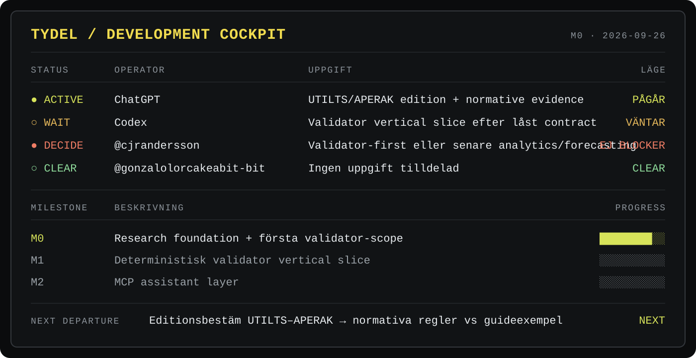
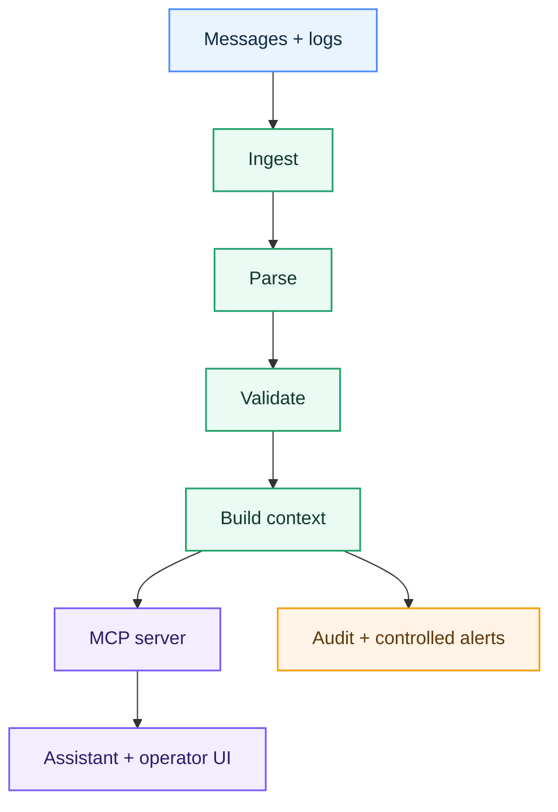

# Tydel

**A clearer way to understand and troubleshoot Ediel messages.**

> **Status:** Research and early prototype. There is no runnable MCP server yet.

---

# 🧭 Development Status — Team Cockpit

> **This is the operational source of truth for where Tydel is right now.**  
> Update this section whenever implementation status, architecture, milestone completion, ownership or the immediate next step changes.

> The board above is the fast visual overview. The tables below are the machine-readable source of truth and must stay synchronized with the board.

| | Current state |
|---|---|
| **Current milestone** | **M0 — Research foundation & first validator scope** |
| **Status** | 🟡 **IN PROGRESS** |
| **Current objective** | Lock the first narrow, authoritative and testable Ediel validation slice before application code is expanded |
| **Exact next task** | Run an independent architecture/product peer review and produce a recommendation for the first supported Swedish message/profile + validator contract |
| **Next-task owner** | **ChatGPT** |
| **Blocked / waiting on team** | ✅ **Nothing required from @cjrandersson right now** |
| **Codex state** | ⏸ **WAITING** — implementation should start after the first validator slice is locked |
| **Next milestone** | **M1 — First deterministic validator vertical slice** |
| **Last updated** | **2026-09-25** |

### Active ownership / pending

| Owner | Pending now | State |
|---|---|---|
| **@cjrandersson** | Nothing required before the peer review / scope recommendation | ✅ **CLEAR** |
| **ChatGPT** | Stress-test Tydel architecture/product assumptions and recommend the first validator slice | 🟡 **NEXT MOVE** |
| **Codex** | Begin implementation only after the first message/profile and validator contract are locked | ⏸ **WAITING** |
| **@gonzalolorcakeabit-bit** | Nothing assigned | ⚪ **CLEAR** |

> **Ownership rule:** nothing may be marked `pending`, `blocked`, `waiting` or `next` without an explicit owner. If Robin must act, show it explicitly as `🚨 @cjrandersson — <required action>`. Use `ChatGPT`, `Codex` or a named collaborator for other owners. Do not invent GitHub handles.

### Milestone progress

- [ ] **M0 — Research foundation & first validator scope** ← **CURRENT**
  - [x] Core problem and first user value defined
  - [x] Read-only first-version boundary defined
  - [x] Deterministic parser / validator as source of truth defined
  - [x] MCP positioned as controlled access/explanation layer, not validation authority
  - [x] Architecture documented
  - [x] Reference-library structure established
  - [x] Official-source / edition separation established
  - [x] Synthetic test-fixture policy established
  - [ ] Independent peer review of architecture and product assumptions — **ChatGPT**
  - [ ] Select first supported Swedish message/profile — **ChatGPT recommendation → @cjrandersson approval if a product choice is required**
  - [ ] Define the first validator contract and structured error output — **ChatGPT / Codex**
  - [ ] Define authoritative positive + negative fixtures for that slice — **ChatGPT / Codex**
  - [ ] Review `package.json` and `tsconfig.json` against the locked vertical slice — **Codex**

- [ ] **M1 — First deterministic validator vertical slice**
  - [ ] Create production `src/` structure
  - [ ] Implement parser for the selected message/profile
  - [ ] Implement deterministic validation rules
  - [ ] Return exact segment / rule / evidence / safe next step
  - [ ] Add positive and negative unit fixtures
  - [ ] Add repeatable offline test suite
  - [ ] Provide a runnable local validation entry point

- [ ] **M2 — MCP assistant layer**
  - [ ] Expose validator through MCP tools
  - [ ] Expose approved reference material through controlled resources
  - [ ] Add plain-language explanation of verified validator output
  - [ ] Preserve evidence and source traceability
  - [ ] Keep write/change actions out of scope

- [ ] **M3 — Observability & real-world validation**
  - [ ] Add validation history / trends
  - [ ] Add controlled alerts
  - [ ] Test with representative operator workflows
  - [ ] Find first design-partner / pilot candidate
  - [ ] Measure time saved and diagnostic accuracy

**Rule:** a meaningful project change is not fully documented until this cockpit reflects the new state **and the correct owner for every pending action**.

---

Tydel is a planned validation and support layer for energy-market communication. It helps operators find message errors, understand what they mean and decide what to do next.

The first focus is the Swedish electricity market. Tydel will work beside existing Ediel and EDI systems—not replace them.

## The problem

Energy companies exchange important information through Ediel, including meter values, supplier changes and settlement data.

When a message is wrong, rejected or delayed, specialists often need to inspect EDIFACT segments, implementation rules and several systems by hand. That takes time and makes support dependent on a small number of experts.

## The first version

The first useful version of Tydel will be a read-only validator and support assistant. It should:

- accept a copied Ediel message or recorded error;
- parse and validate the message with fixed, testable rules;
- point to the exact segment and broken rule;
- explain the problem in plain language;
- suggest a safe next step;
- show the evidence behind the answer.

Tydel will not change or resend production messages in this phase.

## How it works

| Color | Meaning |
| --- | --- |
| Blue | Input from existing systems |
| Green | Tydel's deterministic core |
| Purple | MCP and the operator experience |
| Orange | Logged or controlled side effects |

The parser and validator are the source of truth. MCP gives compatible AI applications controlled access to tools and approved reference material. The AI explains verified results; it does not decide whether a message is valid.

Read the deeper technical overview in [ARCHITECTURE.md](ARCHITECTURE.md).

## Plan

1. **Research** — verify Ediel processes, terms, specifications and test data.
2. **Validator** — parse selected messages and return structured errors.
3. **MCP assistant** — expose validation tools and approved documentation through MCP.
4. **Observability** — add trends, dashboards and controlled notifications.

Ideas such as automatic corrections, retransmission, forecasting and grid-capacity analysis are not part of the first version. They require separate data, controls and validation.

## Safety rules

- Read-only by default.
- Fixed validation rules before AI interpretation.
- Human approval for actions that change data or affect operations.
- Clear sources and evidence for every recommendation.
- Least-privilege access and complete audit logs.
- Synthetic or properly anonymized test data only.
- No compliance claims without a documented assessment.

## Technology

TypeScript and the official MCP TypeScript SDK are the current starting point. This is not a permanent decision. We will keep this choice only if it continues to support correctness, security and simple operation.

## Project files

| Path | What belongs there |
| --- | --- |
| [`ARCHITECTURE.md`](ARCHITECTURE.md) | System design, boundaries and data flow |
| [`docs/`](docs/) | Research, decisions and deeper documentation |
| [`reference/`](reference/) | Official-source catalogue, licensed MCP files and local download instructions |
| [`AGENTS.md`](AGENTS.md) | Guidance for Codex and other coding assistants |
| [`assets/graphics/`](assets/graphics/) | Diagrams, source graphics and exports |
| [`fixtures/edifact/`](fixtures/edifact/) | Synthetic EDIFACT test messages |
| [`scripts/reference_library.py`](scripts/reference_library.py) | Reference download and checksum checks; not application code |
| [`tests/`](tests/) | Offline tests for the reference helper |
| [`misc/`](misc/) | Temporary material waiting to be classified |
| `src/` | Future implementation; not created yet |

## Current repository status

- `package.json` and `tsconfig.json` are early scaffolding and still need review.
- `fixtures/edifact/mock_mscons.edi` is a synthetic research fixture, not an authoritative Ediel example.
- Installation instructions will be added when the first tested vertical slice can run.

## Reference material

Start with the [reading guide](docs/research/reading-guide.md) and
[reference library](reference/README.md). Sources are separated by country,
format and edition. Licensed MCP originals are included in Git; other permitted
public downloads stay in a local, Git-ignored cache. Restricted sources remain
links only. This is reference material, not an approved model-training dataset.

The Swedish meter-data research starts with UTILTS/APERAK. The existing MSCONS
fixture does not establish which profile the first product should support.

## Svenska

Visa en kort svensk beskrivning

Tydel är ett planerat validerings- och supportlager för Ediel. Det ska hjälpa energimarknadens aktörer att hitta fel i meddelanden, förstå orsaken och se ett säkert nästa steg.

Den första versionen blir read-only och arbetar bredvid befintlig EDI-infrastruktur. Fasta och testbara regler avgör om ett meddelande är korrekt. MCP gör sedan valideringsverktyg och godkänt referensmaterial tillgängligt för en AI-assistent, som kan förklara resultatet på begripligt språk.

## Sources

- [Model Context Protocol](https://modelcontextprotocol.io/)
- [Svenska kraftnät: Använda Ediel](https://www.svk.se/aktorsportalen/it-systemsupport/anvanda-ediel/)
- [eSett](https://www.esett.com/)
- [esbuild architecture documentation](https://github.com/evanw/esbuild/blob/main/docs/architecture.md)

## Disclaimer

Tydel is an independent research and development project. It is not affiliated with, endorsed by or certified by Svenska kraftnät, eSett or any market participant.
