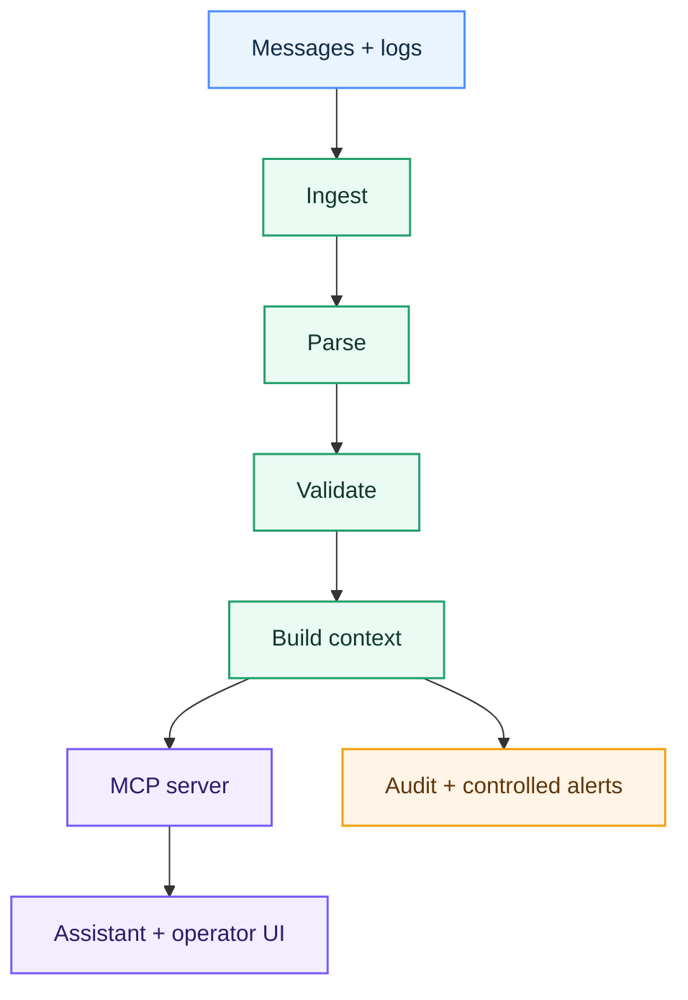

# Tydel

**A clearer way to understand and troubleshoot Ediel messages.**

> **Status:** Research and early prototype. There is no runnable MCP server yet.

Tydel is a planned validation and support layer for energy-market communication. It helps operators find message errors, understand what they mean and decide what to do next.

The first focus is the Swedish electricity market. Tydel will work beside existing Ediel and EDI systems—not replace them.

## The problem

Energy companies exchange important information through Ediel, including meter values, supplier changes and settlement data.

When a message is wrong, rejected or delayed, specialists often need to inspect EDIFACT segments, implementation rules and several systems by hand. That takes time and makes support dependent on a small number of experts.

## The first version

The first useful version of Tydel will be a read-only validator and support assistant. It should:

- accept a copied Ediel message or recorded error;
- parse and validate the message with fixed, testable rules;
- point to the exact segment and broken rule;
- explain the problem in plain language;
- suggest a safe next step;
- show the evidence behind the answer.

Tydel will not change or resend production messages in this phase.

## How it works

| Color | Meaning |
| --- | --- |
| Blue | Input from existing systems |
| Green | Tydel's deterministic core |
| Purple | MCP and the operator experience |
| Orange | Logged or controlled side effects |

The parser and validator are the source of truth. MCP gives compatible AI applications controlled access to tools and approved reference material. The AI explains verified results; it does not decide whether a message is valid.

Read the deeper technical overview in [ARCHITECTURE.md](ARCHITECTURE.md).

## Plan

1. **Research** — verify Ediel processes, terms, specifications and test data.
2. **Validator** — parse selected messages and return structured errors.
3. **MCP assistant** — expose validation tools and approved documentation through MCP.
4. **Observability** — add trends, dashboards and controlled notifications.

Ideas such as automatic corrections, retransmission, forecasting and grid-capacity analysis are not part of the first version. They require separate data, controls and validation.

## Safety rules

- Read-only by default.
- Fixed validation rules before AI interpretation.
- Human approval for actions that change data or affect operations.
- Clear sources and evidence for every recommendation.
- Least-privilege access and complete audit logs.
- Synthetic or properly anonymized test data only.
- No compliance claims without a documented assessment.

## Technology

TypeScript and the official MCP TypeScript SDK are the current starting point. This is not a permanent decision. We will keep this choice only if it continues to support correctness, security and simple operation.

## Project files

| Path | What belongs there |
| --- | --- |
| [`ARCHITECTURE.md`](ARCHITECTURE.md) | System design, boundaries and data flow |
| [`docs/`](docs/) | Research, decisions and deeper documentation |
| [`assets/graphics/`](assets/graphics/) | Diagrams, source graphics and exports |
| [`fixtures/edifact/`](fixtures/edifact/) | Synthetic EDIFACT test messages |
| [`misc/`](misc/) | Temporary material waiting to be classified |
| `src/` | Future implementation; not created yet |

## Current repository status

- `package.json` and `tsconfig.json` are early scaffolding and still need review.
- `fixtures/edifact/mock_mscons.edi` is a synthetic research fixture, not an authoritative Ediel example.
- Installation instructions will be added when the first tested vertical slice can run.

## Svenska

Visa en kort svensk beskrivning

Tydel är ett planerat validerings- och supportlager för Ediel. Det ska hjälpa energimarknadens aktörer att hitta fel i meddelanden, förstå orsaken och se ett säkert nästa steg.

Den första versionen blir read-only och arbetar bredvid befintlig EDI-infrastruktur. Fasta och testbara regler avgör om ett meddelande är korrekt. MCP gör sedan valideringsverktyg och godkänt referensmaterial tillgängligt för en AI-assistent, som kan förklara resultatet på begripligt språk.

## Sources

- [Model Context Protocol](https://modelcontextprotocol.io/)
- [Svenska kraftnät: Använda Ediel](https://www.svk.se/aktorsportalen/it-systemsupport/anvanda-ediel/)
- [eSett](https://www.esett.com/)
- [esbuild architecture documentation](https://github.com/evanw/esbuild/blob/main/docs/architecture.md)

## Disclaimer

Tydel is an independent research and development project. It is not affiliated with, endorsed by or certified by Svenska kraftnät, eSett or any market participant.
