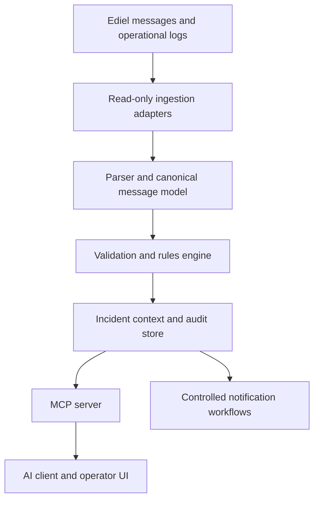

# Tydel

**An explainability and validation layer for Ediel-based energy-market communication.**

> **Project status:** Research, architecture and early prototype. This repository does not yet contain a production-ready or runnable MCP server.

Tydel explores how deterministic validation, operational context and the [Model Context Protocol (MCP)](https://modelcontextprotocol.io/) can make legacy energy-market messages easier to understand, troubleshoot and support.

The initial focus is the Swedish electricity market. The longer-term opportunity is a reusable observability and support layer for Nordic energy-market communication.

## The problem

The Swedish electricity market exchanges business-critical information through Ediel and related market processes, including meter values, supplier changes and settlement data.

When a message is rejected, delayed or malformed, troubleshooting may require manual coordination between electricity suppliers, distribution system operators (DSOs), balance responsible parties (BRPs), service providers and system vendors. The underlying EDIFACT messages and implementation rules are difficult to interpret without specialist knowledge.

## Proposed solution

Tydel is intended to sit beside existing EDI infrastructure as a support and analysis layer. It does **not** replace Ediel, existing EDI routers or authoritative market systems.

The first product direction is a read-only validator and support assistant that can:

- ingest copied messages, validation results and operational logs;
- parse and validate messages using deterministic rules;
- identify the segment and rule associated with an error;
- assemble verified operational context;
- expose validation tools and reference material through MCP;
- explain errors and recommended actions in clear language;
- preserve source evidence and an audit trail;
- notify or hand off to the appropriate operator when configured.

Any generated explanation or recommendation must remain traceable to deterministic validation results and approved reference material.

## Why MCP?

MCP is the interface between Tydel's domain services and compatible AI applications. It is not the parser, validation engine or language model.

An MCP server can expose:

- **Tools** for validating a message, inspecting an incident or retrieving error context;
- **Resources** containing approved specifications, code lists and implementation guidance;
- structured results that an AI client can turn into an explanation or support workflow.

The deterministic core must continue to work without an LLM. AI is used for interpretation and interaction—not as the source of truth for message validity.

## Proposed architecture

### Architectural boundaries

- Existing EDI infrastructure remains authoritative.
- Ingestion is read-only in the initial phase.
- Parsing and validation are deterministic and testable.
- MCP provides controlled access to data and capabilities.
- The LLM explains evidence; it does not invent missing operational facts.
- Corrections, retransmissions and other state-changing actions require explicit authorization, validation and audit logging.

Transport mechanisms such as SFTP, APIs, AS2 or HTTPS are adapter choices to be decided from real pilot-system requirements. They are not fixed parts of the architecture yet.

## Initial use case

Given a copied Ediel message or recorded validation failure, Tydel should be able to return:

1. message type and identifiable parties;
2. exact segment and element where validation failed;
3. deterministic error code and applicable rule;
4. plain-language explanation;
5. suggested next diagnostic or corrective step;
6. evidence and references used to produce the result.

The system should return a structured validation error rather than crash when it encounters invalid input.

## Delivery phases

### Phase 0 — Domain research and foundations

- Verify Swedish Ediel processes, message types and terminology.
- Collect legally reusable specifications and representative synthetic test data.
- Define the canonical message and validation-result schemas.
- Establish security, privacy and audit requirements.

### Phase 1 — Read-only validator

- Parse selected Ediel/EDIFACT messages.
- Run deterministic structural and domain validations.
- Produce structured, traceable error reports.
- Test locally with synthetic or safely anonymized data.

### Phase 2 — MCP support assistant

- Expose validation and incident-inspection tools through MCP.
- Provide approved specifications and code lists as MCP resources.
- Generate evidence-linked explanations for operators.
- Add a minimal operator interface.

### Phase 3 — Operational observability

- Correlate message failures across authorized logs and systems.
- Add dashboards, trends and controlled notifications.
- Introduce role-based access control and deployment integrations.

### Future opportunities — not committed scope

- Human-approved correction workflows.
- Carefully constrained automation for low-risk actions.
- Support for additional Nordic market formats and processes.
- Forecasting or grid-capacity analysis only if supported by separate, appropriate datasets and validated models.

## Safety and security principles

- Read-only by default.
- Least-privilege access to customer systems.
- No production message modification without explicit authorization.
- Human approval for consequential actions.
- Complete auditability of data access, tool calls and recommendations.
- Data minimization and clear retention policies.
- Tenant isolation and customer-controlled credentials.
- Deployment and data-residency requirements assessed per customer and use case.
- No claim of regulatory compliance without a documented assessment.

Swedish security-protection legislation, the Cybersecurity Act/NIS2-related requirements, GDPR and sector-specific obligations may be relevant depending on the operator, data and deployment. Applicability must be assessed rather than assumed.

## Technology direction

The current repository uses TypeScript configuration and references the official MCP TypeScript SDK. This is an initial direction, not a final platform decision.

TypeScript is a reasonable starting point for the MCP interface and an MVP because it provides:

- a mature Node.js integration ecosystem;
- official MCP SDK support;
- shared types between services and a future web interface;
- fast iteration during domain discovery.

Parser correctness, validation coverage, security and operability matter more than language preference. Other languages or isolated services should only be introduced when measurable requirements justify the added complexity.

## Repository contents

| Path | Status | Purpose |
| --- | --- | --- |
| `README.md` | Current | Product scope, principles and proposed architecture |
| `package.json` | Scaffolding | Initial TypeScript and MCP dependencies; requires review |
| `tsconfig.json` | Scaffolding | Initial TypeScript compiler configuration |
| `mock_mscons.edi` | Synthetic fixture | Early mock message for research; not an authoritative Ediel example |
| `src/` | Not yet present | Future implementation |

## Local development

There is not yet a runnable implementation. Installation and execution instructions will be added when the first tested vertical slice exists. Until then, commands that imply a working server would be misleading.

## Decision principles

Major technical choices should be documented with their context, alternatives and consequences. The project will favor:

- verified domain knowledge over generated assumptions;
- a narrow working vertical slice over speculative platform breadth;
- deterministic validation before AI interpretation;
- reversible integrations before inline control;
- evidence-linked output over opaque AI conclusions;
- explicit project boundaries over feature accumulation.

## Svenska sammanfattning

Visa projektbeskrivningen på svenska

Svenska elmarknaden utbyter stora mängder affärskritisk information genom Ediel, exempelvis mätvärden, leverantörsbyten och avräkningsunderlag. När meddelanden fastnar eller innehåller fel krävs ofta manuell felsökning mellan marknadsaktörer och deras IT-leverantörer.

Tydel utforskar ett MCP-baserat support- och analyslager som säkert kopplar AI-applikationer till deterministiska valideringsverktyg, godkända specifikationer, meddelandeflöden och driftdata. Lösningen ska kunna lokalisera ett fel, visa vilken regel som brutits, förklara orsaken och föreslå ett spårbart nästa steg.

Tydel ersätter inte Ediel-infrastrukturen. Målet är att göra den begripligare, snabbare att felsöka och billigare att stödja. Den första produkten är tänkt som en fristående, read-only validator och supportassistent. På längre sikt kan den utvecklas till ett observability- och supportlager för den nordiska energimarknaden.

## References

- [Model Context Protocol](https://modelcontextprotocol.io/)
- [Svenska kraftnät: Använda Ediel](https://www.svk.se/aktorsportalen/it-systemsupport/anvanda-ediel/)
- [eSett: Data communication](https://www.esett.com/)
- [Swedish Energy Agency: Cybersecurity Act](https://www.energimyndigheten.se/)

## Disclaimer

Tydel is an independent research and development project. It is not affiliated with, endorsed by or certified by Svenska kraftnät, eSett or any named market participant. All example data in this repository must be synthetic or properly anonymized.
