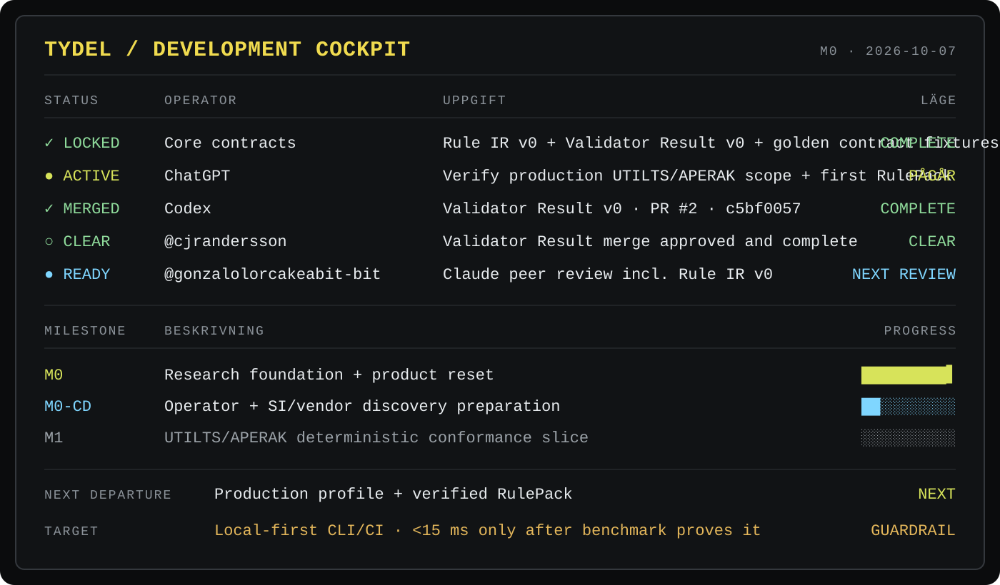

# Tydel

> **Tyda el.**

Tydel är ett lokalt först, utvecklarcentrerat **Conformance & CI/CD Layer** för energimarknadens integrationer, byggt ovanpå en deterministisk conformance- och diagnostikkärna.

Den avgör vilka tekniska och marknadsmässiga regler som gäller för en transaktion, validerar den mot rätt process/profile/version och visar exakt vad som är fel, varför det är fel och vilken evidens som stöder resultatet.

**Validator First** gäller fortfarande: deterministiska regler avgör `PASS/FAIL`; AI används först efter validering för förklaring och assistans. Svensk Ediel är första wedge. Framtida DHV- och CIM/IEC 62325-stöd läggs till först när auktoritativa tekniska kontrakt finns.

Primära ytor är lokal CLI, CI/CD-gate och GitHub Action. MCP är ett accesslager, inte produkten eller dess moat.

`<15 ms` är ett **performance target**, inte ett produktclaim, tills en reproducerbar benchmark har definierats och mätts.

Se [`docs/product/positioning.md`](docs/product/positioning.md), [`Decision 0005`](docs/decisions/0005-post-dhv-conformance-strategy.md) och [`Decision 0006`](docs/decisions/0006-rule-ir-v0.md).

---

# 🧭 DEVELOPMENT COCKPIT

> **Operativ source of truth:** `project-status.yml`. README och den visuella cockpiten ska spegla samma statusmodell.



| | Aktuellt läge |
|---|---|
| **Nuvarande milestone** | **M0 — Research foundation + post-DHV product reset** |
| **Status** | 🟡 **PÅGÅR** |
| **Nuvarande mål** | Låsa exakt UTILTS/APERAK M1-scope ovanpå färdig **Rule IR v0** och förbereda första verifierade RulePack + validator contract |
| **Exakt nästa tekniska uppgift** | Lås supported UTILTS/APERAK profile/scope, mappa första verifierade reglerna till Rule IR v0 och definiera validator result contract + golden fixtures |
| **Rule IR** | ✅ **LOCKED v0** — bounded deterministic primitives, provenance, temporal validity, explicit unsupported semantics |
| **DHV checkpoint** | ✅ **REVIEWED 2026-10-05** — riktningen ändras långsiktigt, men inga framtida DHV/CIM-kontrakt gissas |
| **Developer direction** | ✅ **APPROVED** — local-first CLI / CI / GitHub Action; `<15 ms` är benchmark target |
| **Discovery-spår** | 5 operator/utility-intervjuer + 5 SI/software-vendor-intervjuer efter färdig discovery-pack |
| **Nästa owner** | **ChatGPT** |
| **Blockerat** | **Nej.** Codex väntar tills supported profile + first verified RulePack + validator contract + fixtures är låsta |
| **Peer review** | ✅ **READY** — **@gonzalolorcakeabit-bit** kan köra Claude mot repo:t inklusive Rule IR v0 |
| **Nästa milestone** | **M1 — UTILTS/APERAK deterministic conformance vertical slice** |
| **Senast uppdaterad** | **2026-10-05** |

### Aktivt ansvar / pending

| Owner | Pending nu | Läge |
|---|---|---|
| **ChatGPT** | Lås UTILTS/APERAK M1-scope, första verifierade RulePack, validator contract och discovery-pack | 🟢 **ACTIVE** |
| **Codex** | Vänta med M1-kod tills supported profile + RulePack + contract + fixtures är låsta | ⏸ **WAITING** |
| **@cjrandersson** | Ingen omedelbar åtgärd; local-first developer direction godkänd | ⚪ **CLEAR** |
| **@gonzalolorcakeabit-bit** | Claude peer review av uppdaterat repo inklusive Rule IR v0 | 🟡 **READY** |

> **Ownership rule:** inget får markeras `pending`, `blocked`, `waiting` eller `next` utan explicit owner. Om Robin behöver agera ska det stå `🚨 @cjrandersson — <åtgärd>`.

### Milestone progress

- [ ] **M0 — Research foundation + product reset** ← **CURRENT**
  - [x] Read-only första versionsgräns definierad
  - [x] Deterministisk parser/validator definierad som source of truth
  - [x] MCP definierat som access-/förklaringslager, inte validation authority
  - [x] Auktoritativ käll- och editionsseparation etablerad
  - [x] OpenEDI utvärderat som kandidat för generiskt EDIFACT-baslager
  - [x] Svensk taxonomigrund etablerad
  - [x] Aktuell UTILTS/APERAK-edition identifierad
  - [x] DHV 2026-09-30 checkpoint genomförd på strateginivå
  - [x] Produktpositionering omdefinierad till **Energy Market Conformance & Diagnostics**
  - [x] Local-first developer / CI direction godkänd
  - [x] RulePack lifecycle och temporal versioning lyfta till first-class concerns
  - [x] **Rule IR v0 låst** — [`docs/architecture/rule-ir-v0.md`](docs/architecture/rule-ir-v0.md)
  - [x] Machine-readable Rule IR schema — [`schemas/rule-ir-v0.schema.json`](schemas/rule-ir-v0.schema.json)
  - [ ] Lås första supported UTILTS/APERAK profile/scope — **ChatGPT**
  - [ ] Mappa första verifierade normativa regelsetet till Rule IR v0 / RulePack — **ChatGPT**
  - [ ] Lås validator result contract + positiva/negativa golden fixtures — **ChatGPT / Codex**

- [ ] **M0-CD — Customer + channel discovery**
  - [x] Problem- och kill/pivot-principer definierade
  - [x] Discovery delas i operator- och SI/vendor-spår
  - [ ] Intervjuguide — **ChatGPT**
  - [ ] Economic-pain scorecard — **ChatGPT**
  - [ ] Failure-case intake template — **ChatGPT**
  - [ ] Första 5 operator/utility-intervjuer — **start efter pack-review**
  - [ ] Första 5 SI/software-vendor-intervjuer — **start efter pack-review**
  - [ ] Minst en aktiv pilotkandidat under M0/M1

- [ ] **M1 — UTILTS/APERAK conformance vertical slice**
  - [ ] EDIFACT input adapter/parser för vald profile
  - [ ] Canonical transaction/context
  - [ ] Rule resolver för process/profile/version/as-of date
  - [ ] Versioned RulePack + Rule IR runtime
  - [ ] Deterministisk validation result med exact rule/source/expected/observed
  - [ ] Golden fixtures och offline regression tests
  - [ ] Lokal CLI + CI/GitHub Action entry point
  - [ ] Definiera och mäta reproducerbar performance benchmark; `<15 ms` är mål, inte krav utan mätdata

- [ ] **M2 — Developer conformance surfaces**
  - [ ] Stabilisera CLI/CI/GitHub Action över samma core
  - [ ] API/UI där kundbehov motiverar det
  - [ ] MCP tools för kontrollerade agentiska utvecklarflöden
  - [ ] Välj Commercial Slice 2 från discovery; PRODAT är kandidat, inte låst beslut

- [ ] **M3 — Change Impact + Migration Assurance** ← **PRODUCT HYPOTHESIS**
  - [ ] Diff mellan två versionsstyrda RulePacks
  - [ ] Kör kundens regression fixtures mot gammal/ny version
  - [ ] Visa affected rules, test cases och integrationskomponenter
  - [ ] Pre-validation mot framtida DHV-contract först när auktoritativa specs finns

- [ ] **M4 — XML/CIM/IEC 62325 selected vertical slice** ← **LATER RESEARCH**
  - [ ] Välj en konkret marknadsprocess
  - [ ] Utvärdera officiella ESMP/profile artifacts
  - [ ] Lägg till XML/CIM-adapter utan att ändra validation-result contract

---

## Vad ändrades efter DHV 2026-09-30?

Ei och Svenska kraftnät har föreslagit ett centralt datahanteringsverktyg för den svenska elmarknaden. Förslaget innebär inte att ett färdigt tekniskt DHV-kontrakt redan är beslutat eller att hela marknadsmodellen ersätts.

Det förändrar Tydels långsiktiga thesis:

```text
INTE:
"Tydel är ett bolag vars framtid beror på dagens svenska Ediel-topologi."

UTAN:
"Tydel validerar energimarknadens integrationskontrakt och marknadsregler över format, versioner och migrationsfaser."
```

**Viktigt:** exakt svensk DHV-tidplan, interface/protokoll, schemaformat, error contract och eventuell IEC 62325-användning behandlas som `UNVERIFIED` tills auktoritativa specifikationer finns.

Se [`docs/research/dhv-strategic-watch.md`](docs/research/dhv-strategic-watch.md).

---

## Vad Tydel ska vara bäst på

Inte EDIFACT. Inte XML. Inte MCP. Inte AI.

Tydels kärnförmåga ska vara **regelresolution**:

```text
transaction
+ market / jurisdiction
+ process
+ profile
+ as-of date
        ↓
applicable versioned rules
        ↓
deterministic conformance result
        ↓
exact failure + normative evidence
```

En generisk syntaxvalidator kan säga att ett fält är fel. Tydel ska kunna säga:

```text
Detta är process Y, profile X och edition Z.
Regel R gällde vid den angivna tidpunkten.
Det observerade värdet bryter mot regeln.
Här är den normativa källan och dess position.
Här är nästa säkra felsökningssteg.
```

---

## Produktkärna

Tydels långsiktiga core är:

```text
RAW INPUT
   ↓
FORMAT ADAPTER / PARSER
   ↓
CANONICAL MARKET TRANSACTION
   ↓
PROCESS + PROFILE + VERSION RESOLVER
   ↓
VERSIONED RULEPACK
   ↓
DETERMINISTIC CONFORMANCE ENGINE
   ↓
STRUCTURED RESULT + PROVENANCE
   ↓
LOCAL CLI / CI / GITHUB ACTION
   ↓
API / UI / MCP where appropriate
```

**M1 implementerar endast det som krävs för UTILTS/APERAK.** Arkitekturen får vara utbytbar men vi bygger inte EDIFACT, XML, CIM, REST och DHV samtidigt.

Se [`ARCHITECTURE.md`](ARCHITECTURE.md).

---

## Rule IR v0 och RulePacks

Rule IR v0 är nu låst som M1:s interna regelkontrakt:

- [`docs/architecture/rule-ir-v0.md`](docs/architecture/rule-ir-v0.md)
- [`schemas/rule-ir-v0.schema.json`](schemas/rule-ir-v0.schema.json)
- [`Decision 0006`](docs/decisions/0006-rule-ir-v0.md)

Flödet är:

```text
Normative source
      ↓
Importer / curated extraction
      ↓
Tydel Rule IR v0
      ↓
Human/source verification
      ↓
Versioned executable RulePack
      ↓
Runtime validator
```

Rule IR v0 innehåller bounded primitives för bland annat presence, cardinality, datatype, allowed values, code lists, restricted conditional presence, reference integrity, sequence och temporal relation.

Det finns **ingen arbitrary-code escape hatch**. Om en verifierad obligatorisk regel inte kan representeras markeras den explicit `unsupported`. Det är arkitekturevidens, inte något som får gömmas i specialkod.

Varje normativ regel bär explicit scope, source, edition, giltighetsperiod, review status och testlänkar.

---

## Local-first developer workflow

Den godkända leveransriktningen är:

```text
developer changes integration
        ↓
local Tydel CLI
        ↓
schema + profile + business rules
        ↓
deterministic validation
        ↓
source-linked diagnostics
        ↓
exit code
        ↓
CI passes / fails
```

Arkitektonisk inspiration hämtas selektivt från:

- **Conftest / OPA** — lokal policy evaluation och CI-vänliga exit semantics;
- **Argo CD** — deklarativ desired-vs-actual diff och reproducerbarhet;
- **Ruff / Biome** — snabb startup och tydliga source-linked terminal diagnostics;
- **kubeconform** — offline schema resolution/cache och parallell validering.

Tydel kopierar inte deras domänmodell. Vi lånar execution- och developer-experience-mönster.

`<15 ms` är ett performance target för en definierad warm local benchmark. Payloadstorlek, antal regler, cache state, hårdvara samt cold/warm semantics måste definieras innan siffran blir ett produktclaim.

---

## Produktlager ovanpå samma core

Fyra produkt-hypoteser kan växa ur samma deterministic engine:

1. **Pre-validation** — testa innan data når motpart/test/prod.
2. **Diagnostics** — hitta exakt regel, rotorsak och evidens.
3. **Change Impact** — visa vad som påverkas mellan två spec/rule-pack-versioner.
4. **Migration Assurance** — bevisa compatibility under legacy ↔ new-interface migration.

`Change Impact` och `Migration Assurance` är strategiskt viktiga hypoteser efter DHV men är inte färdiga produktclaims ännu.

---

## Moat-hypotes

Koden för parsing eller schema validation är inte tillräcklig som moat.

Den starkare hypotesen är kombinationen:

```text
Rule ingestion pipeline
+ executable RulePacks
+ temporal version history
+ normative provenance
+ cross-version mappings
+ validated failure corpus
+ resolution knowledge
+ customer regression suites
+ workflow integration
```

Failure corpus är värdefullt men ska endast byggas med korrekt juridisk, sekretess- och dataskyddsmässig hantering. Ingen konfidentiell kunddata ska hamna i publika repo:t.

---

## Första wedge: svensk Ediel

Första tekniska vertical slice är **UTILTS/APERAK** eftersom research- och evidensläget är längst fram där.

Det är ett arkitekturbevis, inte företagets permanenta marknadsgräns.

PRODAT/leverantörsbyte är en kandidat för nästa kommersiella slice men ska väljas utifrån discovery, inte på antagna WTP-poäng.

---

## Customer discovery och GTM

Discovery testar två separata frågor:

### Operators / utilities

> Är problemet verkligt, återkommande och ekonomiskt relevant?

### SI / software vendors

> Kan Tydel bli ett utvecklar-/QA-lager som distribueras genom dem till flera marknadsaktörer?

Första rundan är 5 + 5 intervjuer. Vi mäter verkliga incidenter och ekonomisk smärta som:

`frequency × investigation time × people/specialist cost × business consequence`

Vi använder inte påhittade fasta trösklar som "200 000 SEK/år" som universell sanning.

Se [`docs/product/customer-discovery.md`](docs/product/customer-discovery.md).

---

## MCP och AI

MCP kan ge AI-agenter och utvecklarverktyg tillgång till smala, verifierbara funktioner, exempelvis:

- `validate_transaction`
- `get_validation_result`
- `get_rule_evidence`
- `compare_rulepacks`

Men MCP är inte det primära kundlöftet. Samma core ska kunna exponeras lokalt eller privat via CLI, API, CI runner, UI eller MCP beroende på kundens säkerhetsmodell.

AI får:

- förklara verifierade findings;
- navigera specifikationer;
- föreslå testfall;
- hjälpa utvecklare förstå en failure.

AI får inte:

- själv bestämma `PASS/FAIL`;
- publicera normativa regler utan source/review;
- gissa ett DHV- eller marknadskontrakt som ännu inte är fastställt.

---

## Post-DHV roadmap

Se [`docs/product/post-dhv-roadmap.md`](docs/product/post-dhv-roadmap.md).

Kort version:

```text
M0     Rule IR v0 [LOCKED] + authoritative M1 profile/RulePack/contract + discovery
M1     UTILTS/APERAK deterministic vertical slice + local CLI/CI benchmark
M2     Stable developer conformance surfaces + validated commercial slice
M3     Change Impact + Migration Assurance hypothesis validation
M4     One selected XML/CIM/IEC 62325 market-process slice
```

Framtida DHV-stöd aktiveras först när auktoritativa tekniska specs existerar.

---

## Säkerhets- och evidensregler

- Read-only som standard.
- Deterministiska regler före AI-tolkning.
- Inga standardpåståenden utan dokumenterad källa och scope.
- Effektiv datum-/versionsresolution är first-class.
- Synthetic eller korrekt anonymiserad testdata.
- Human review av normativa RulePacks.
- Least privilege, auditability och reproducerbara resultat.
- Inga compliance- eller certifieringspåståenden utan separat bevisad grund.

---

## Projektfiler

| Path | Innehåll |
| --- | --- |
| [`project-status.yml`](project-status.yml) | Gemensam statuskälla för Development Cockpit |
| [`ARCHITECTURE.md`](ARCHITECTURE.md) | Conformance architecture och systemgränser |
| [`docs/architecture/rule-ir-v0.md`](docs/architecture/rule-ir-v0.md) | Låst Rule IR v0 + RulePack v0 contract |
| [`schemas/rule-ir-v0.schema.json`](schemas/rule-ir-v0.schema.json) | Machine-readable Rule IR schema |
| [`docs/product/positioning.md`](docs/product/positioning.md) | Canonical post-DHV positioning |
| [`docs/product/post-dhv-roadmap.md`](docs/product/post-dhv-roadmap.md) | 90-day och 6–24 månaders roadmap |
| [`docs/product/customer-discovery.md`](docs/product/customer-discovery.md) | Operator + SI/vendor discovery |
| [`docs/research/dhv-strategic-watch.md`](docs/research/dhv-strategic-watch.md) | DHV checkpoint + follow-up watch |
| [`docs/research/cim-iec62325-tooling.md`](docs/research/cim-iec62325-tooling.md) | Framtida XML/CIM/IEC 62325 research track |
| [`docs/decisions/`](docs/decisions/) | Låsta tekniska och produktstrategiska beslut |
| [`reference/`](reference/) | Källkatalog och referensmaterial |
| [`AGENTS.md`](AGENTS.md) | Instruktioner för coding assistants |

---

## Primära marknadskällor

- Svenska kraftnät, Aktörsportalen / Ediel / implementationsguider
- Energimarknadsinspektionen (Ei), föreskrifter och marknadsregler
- Ei/Svenska kraftnät, **Förslag om ett centralt datahanteringsverktyg för elmarknaden**, Ei R2026:08 / Svk 2025/5201
- eSett, Nordic Imbalance Settlement Handbook och relaterad dokumentation
- ENTSO-E för relevanta europeiska market-message-profiler

Externa projekt som OpenEDI, CIMTool och OpenCGMES är tekniska referenser eller machine-readable tooling, inte automatiskt auktoriteter för svensk marknadsanvändning.

## Disclaimer

Tydel är ett oberoende research- och utvecklingsprojekt. Det är inte anslutet till, godkänt av eller certifierat av Svenska kraftnät, Ei, eSett, ENTSO-E, EdiNation/EdiFabric eller någon marknadsaktör.
